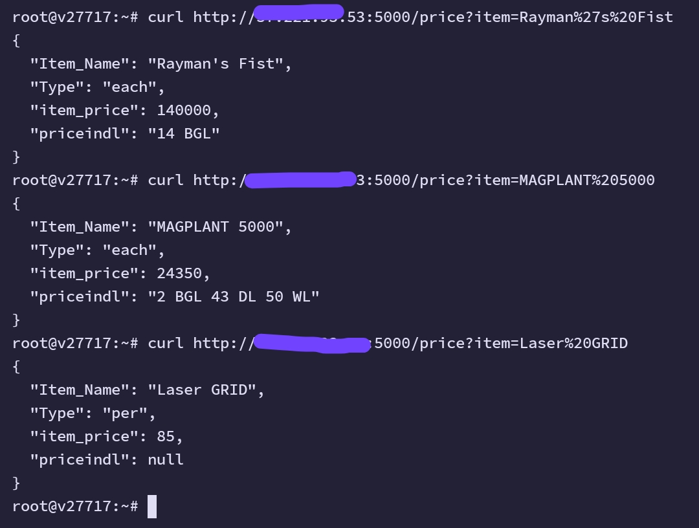

# Growtopia-Price
Growtopia-Price is a rest-api to check howmuch in game price automaticly by scraping ihemo discord and give it to ai to calculate the price.

> [!WARNING]
> THIS CODE MAY VIOLATE DISCORD TERMS, USE AT YOUR OWN RISK

# WHAT YOU NEED
1. GOOGLE GEMINI API KEY ( IT IS FREE )
2. DISCORD AUTH TOKEN
CHANGE THAT AT .ENV.EXAMPLE AND RENAME IT TO .ENV
3. YOUR DISCORD ACCOUNT MUST JOIN IHEMO SERVER BECAUSE IT SCRAPE IHEMO DISCORD SERVER.

# Some Screenshoot

# Author
created by RvLnd

pls ignore my bad prompt writing.. i suggest you to enchance it if you want

tested in python3.10, if you use the latest version of python and have gemini sdk error, u can use the gemini rest api 
